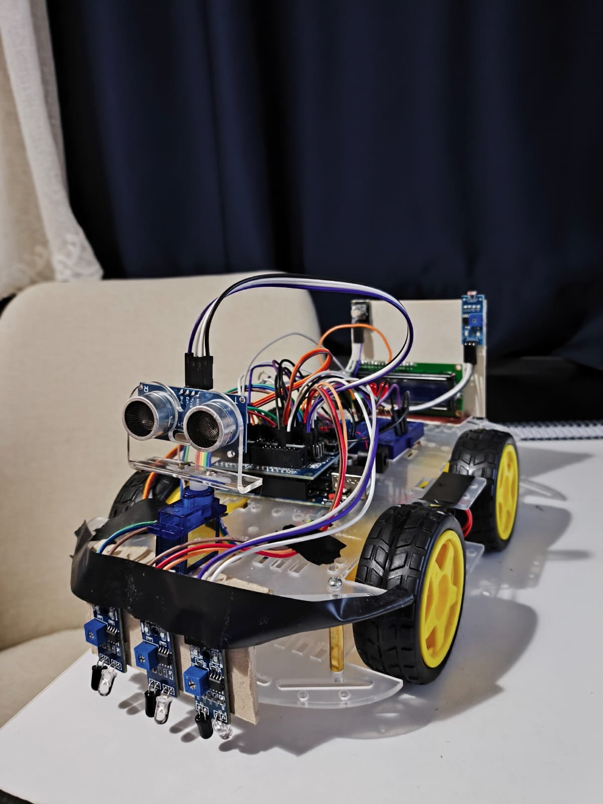

#  Line-Following Autonomous Robot Car

An Arduino-based robot car developed as part of an **Embedded Systems Programming** course. The robot supports multiple operating modes and can be switched between them in real time using an IR remote control.

---

## Features

- **Line Following** — Autonomously follows a black line on the ground using 3 IR sensors
- **Obstacle Avoidance** — Detects obstacles via ultrasonic sensor and steers around them using a servo-mounted scanner
- **IR Remote Control** — Manually drive the robot (forward, backward, left, right, stop) or switch modes remotely
- **LCD Status Display** — 16x2 I2C LCD shows the current mode and elapsed time in real time
- **Automatic LED Headlights** — 3 onboard LEDs activate automatically in low-light conditions via an LDR sensor

---

## Hardware Components

| Component | Purpose |
|---|---|
| Arduino Uno | Main microcontroller |
| Arduino Sensor Shield v5 | Simplifies sensor and module wiring |
| L298N Motor Driver | Controls the two DC motors |
| IR Sensor (x3) | Line detection (left, mid, right) |
| Ultrasonic Sensor (HC-SR04) | Obstacle distance measurement |
| Servo Motor | Rotates ultrasonic sensor to scan left/right |
| IR Receiver | Receives remote control signals |
| LDR Sensor | Ambient light detection |
| LED (x3) | Automatic headlights |
| 16x2 I2C LCD | Real-time status display |

---

## Operating Modes

### 1. Manual Mode
Control the robot directly with the IR remote:
- **24** → Forward
- **82** → Backward
- **8** → Left
- **90** → Right
- **28** → Stop

### 2. Line Following Mode (code: 69)
The robot follows a black line using 3 IR sensors. If the line is lost, it attempts a recovery sequence before stopping.

### 3. Obstacle Avoidance Mode (code: 70)
When an obstacle is detected within 20 cm, the robot stops, scans left and right with the servo, and turns toward the clearer path.

---

## Libraries Used

- [IRremote](https://github.com/Arduino-IRremote/Arduino-IRremote)
- [Servo](https://www.arduino.cc/reference/en/libraries/servo/)
- [LiquidCrystal_I2C](https://github.com/johnrickman/LiquidCrystal_I2C)
- Wire (built-in)

---

## Course

**Embedded Systems Programming** — Computer Engineering
